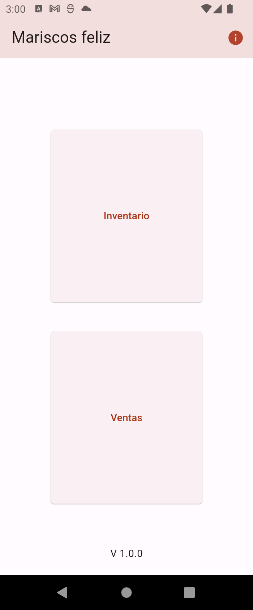
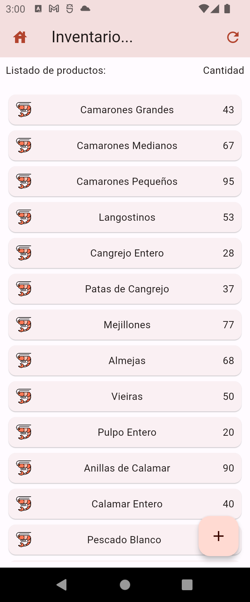
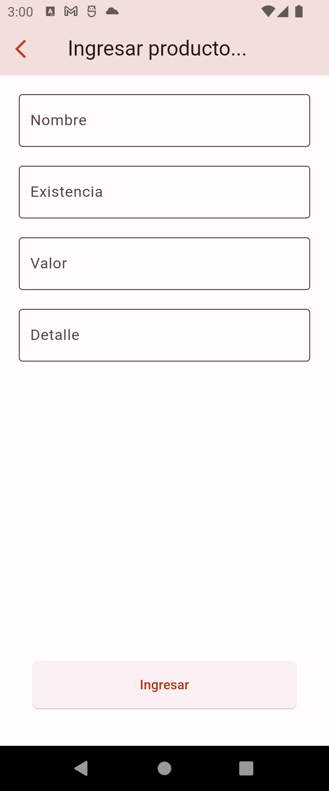
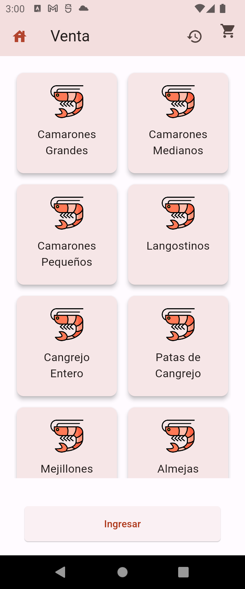
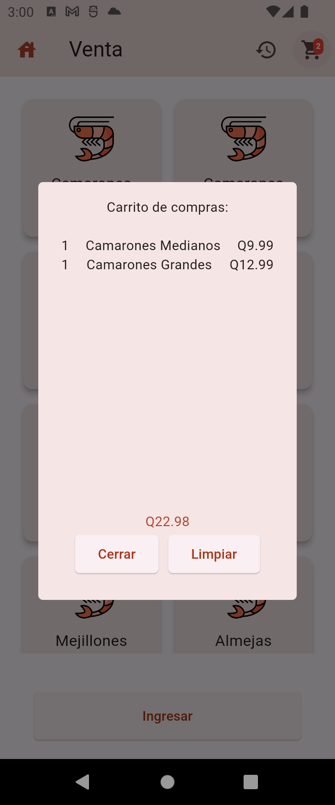
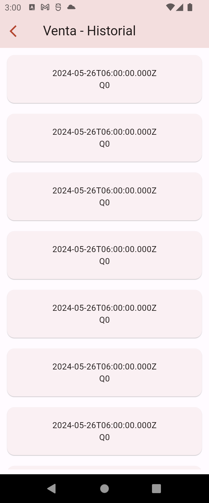

## Titutlo 
Marisqueria feliz

## Uso

Aplicacion para gestion de inventario para una marisqueria y venta de productos, apliacion realiada en Flutter, disponible para dispositivos Android.

### Acciones que realiza esta aplicacion: 
- Ingreso de nuevos productos.
- Listado de existencias de productos
- Venta de productos
- Consulta de registro de ventas


## variables de entorno que necesita: 
```
API_SERVER=...
```

## paquetes utilizados

### http: ^0.13.6
Ulizada para la consulta de solicitudes al servidor

### flutter_dotenv: ^5.1.0
Utilizada para cargar un archivo .env

## Comandos para ejecutar

### Compilar
```
flutter clean 
flutter pub get
flutter run
```

### Generar apk
```
flutter build apk
```

## Notas extras
Recordar habilitar depuracion usb en dispositivo y coneccion a internet.
La aplicacion hace consultas a un servidor local, pero el servidor usa datos almacenados en una base de atos relacional en la nube.

## Capturas






